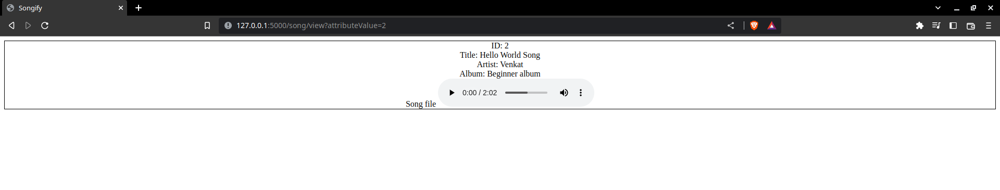

# Songify

## Project setup

* Install all libraries from requirements.txt using
    ```
    pip install -r requirements.txt
    ```

* Once installed, open terminal ( console) in the directory where you stored Songify. Then execute 
    ```
    cd Songify
    ```

* Grant permissions to files:
    ```
    chmod -x app.py
    chmod a+x create-table.py
    ```

* To setup the SQLite3 db, you need to execute a python script:
    ```
    python create-table.py
    ```

* This will create file, `musicDB.db`. You can open it using `sqlitebrowser`.
* If you don't have sqlitebrpwser, follow the steps to download this by [clicking here](https://sqlitebrowser.org/dl/)

* Once the db is created you can run the server using following command:
    ```
    python app.py
    ```

* *Open the project in web browser using*
    
    http://127.0.0.1:5000/

## Screenshots

### Homepage


### Create song
Click "Create New Song" button in homepage.


### View song
Click "View" button in homepage of that particular song division.


### Download song
Click the "three dot menu button" of the audio file of the song division that you want to download. You get prompt to "Download". Click to download the song.


### Edit song
After clicking "Edit" button.


Updated data change visible in homepage


### Search using title


### Search using artist


### Search using album


### Delete song
Click "Delete" button in homepage in the song division that you want to delete.
The view of homepage once you delete song with ID:1.
